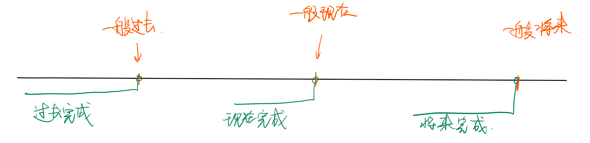

- [简单句](#%E7%AE%80%E5%8D%95%E5%8F%A5)
  - [时态](#%E6%97%B6%E6%80%81)
    - [一般过去将来时：](#%E4%B8%80%E8%88%AC%E8%BF%87%E5%8E%BB%E5%B0%86%E6%9D%A5%E6%97%B6)
    - [完成时态](#%E5%AE%8C%E6%88%90%E6%97%B6%E6%80%81)
    - [完成进行时态：](#%E5%AE%8C%E6%88%90%E8%BF%9B%E8%A1%8C%E6%97%B6%E6%80%81)
  - [情态](#%E6%83%85%E6%80%81)
  - [形容词、副词及其比较级](#%E5%BD%A2%E5%AE%B9%E8%AF%8D%E5%89%AF%E8%AF%8D%E5%8F%8A%E5%85%B6%E6%AF%94%E8%BE%83%E7%BA%A7)
    - [省略现象](#%E7%9C%81%E7%95%A5%E7%8E%B0%E8%B1%A1)
  - [句子成分扩展](#%E5%8F%A5%E5%AD%90%E6%88%90%E5%88%86%E6%89%A9%E5%B1%95)
    - [非谓语动词](#%E9%9D%9E%E8%B0%93%E8%AF%AD%E5%8A%A8%E8%AF%8D)
- [长难句](#%E9%95%BF%E9%9A%BE%E5%8F%A5)
  - [并列句](#%E5%B9%B6%E5%88%97%E5%8F%A5)
  - [复合句（主从复合句）](#%E5%A4%8D%E5%90%88%E5%8F%A5%E4%B8%BB%E4%BB%8E%E5%A4%8D%E5%90%88%E5%8F%A5)
  - [特殊句式](#%E7%89%B9%E6%AE%8A%E5%8F%A5%E5%BC%8F)

# 简单句
## 时态
### 一般过去将来时：
  - 谓语动词：`would + do` 或者 `was/were going to + do`
  - 用处：此时态通常与上下文的一般过去时搭配；
###  完成时态
  - 完成不一定代表全部完成，还有“部分完成”的意思

完成时表示的是*阶段*，一般时态是时间点；
- 区分*一般过去*和*现在完成*
  
   正如上文所说，完成时可以有两种含义：已经完成和部分完成
   1. 表示已经完成的时候可以和*一般过去时*互换，但是强调不同
   
        现在完成时强调的是 *过去对现在的影响*（一般会在上下文中表明这种影响） ，一般过去只是陈述。
   2. 表示部分完成不可和*一般过去*互换。
        - I learned English for 15 years.（过去学了15年）
        - I have learned English for 15 years.（过去学了15年，现在还在学）
### 完成进行时态：
  - 仅是更进一步地表示*强调*谓语的过程了。
  - 不考虑强调的话，和完成时互换没有语法问题。

---

## 情态

有两种用途：表达 *情绪* 和 *推测*

1. 表 *情绪*

其中的过去式一般来说表示更委婉的语气（`must`没有过去时）

2. 表 *推测*

（`must`没有否定的推测，must not 表示禁止）

3. 情态动词+`have done`

表达对之前发生的事情的*情绪* 或 *推测*

4. 情态动词+`be doing`

表达对正在进行的事情的*情绪* 或 *推测*

---

## 形容词、副词及其比较级

- Few people are as **fertile** as in the past.

### 省略现象

## 句子成分扩展

### 非谓语动词
包括：`doing`, `done`, `to do`

除了做 <u>主语</u>，<u>宾语</u>，<u>表语</u>，还可以做定语和状语。

1. 作定语

确定非谓语动词表示的是主动(`doing`)、被动(`done`)还是目的(`to do`)，就要看该*非谓语动词*和逻辑主语（即所修饰的名词）的关系。

2. 作状语

修饰句子；其逻辑主语就是该*句子*的主语。

注意：这种句子不是什么从句！：
- People are ... poor at considering background information **when** *making individual decisions.*
  - 非谓语动词作状语时，可以使用*从属连词*连接，以更明确地说明补充的内容和主语（句子）之间的关系

**非谓语动词最重要的是判断出它修饰的是某个<u>名词</u>还是某个<u>句子</u>，这样才能更好地理解句子**。

1. 在判断非谓语动词`doing`和`done`时，秘诀是观察它的位置和*逗号*——如果前后直接挨着名词，就是用来修饰名词的。如果没有直接挨着名词，或者有逗号隔开，则修饰句子作状语。
2. `to do`放在句首是用来修饰整句话的。如果在句中，不论是修饰句子还是名词都没有逗号隔开，只能采用<u>代入法</u>——根据意思判断是否合适。

---

# 长难句

## 并列句

表转折的词：`yet`, `whereas` 都表示**但是**

## [复合句（主从复合句）](file:///C:\Users\29388\Documents\code\markdown\English\句句真研（复合句）.md)

## [特殊句式](file:///C:\Users\29388\Documents\code\markdown\English\句句真研（特殊句式）.md)